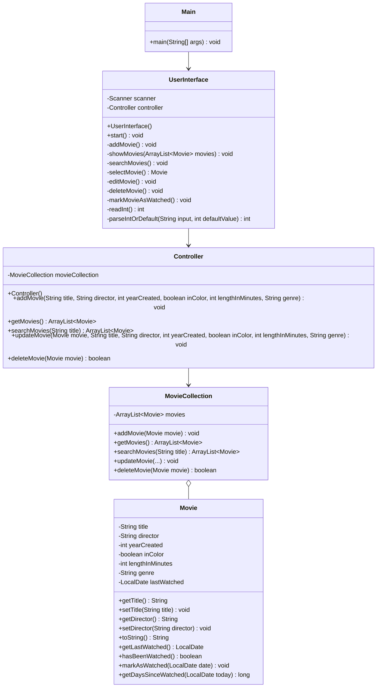

# Klassediagram – Filmsamling

```mermaid
classDiagram
    class Main {
        +main(String[] args) void
    }

    
class UserInterface {
    -Scanner scanner
    -Controller controller
    +UserInterface()
    +start() void
    -addMovie() void
    -showMovies(ArrayList~Movie~ movies) void
    -searchMovies() void
    -selectMovie() Movie
    -editMovie() void
    -deleteMovie() void
    -markMovieAsWatched() void
    -readInt() int
    -parseIntOrDefault(String input, int defaultValue) int
}


    
class Controller {
    -MovieCollection movieCollection
    +Controller()
    +addMovie(String title, String director, int yearCreated, boolean inColor, int lengthInMinutes, String genre) void
    +getMovies() ArrayList~Movie~
    +searchMovies(String title) ArrayList~Movie~
    +updateMovie(Movie movie, String title, String director, int yearCreated, boolean inColor, int lengthInMinutes, String genre) void
    +deleteMovie(Movie movie) boolean
}


    class MovieCollection {
        -ArrayList~Movie~ movies
        +addMovie(Movie movie) void
        +getMovies() ArrayList~Movie~
        +searchMovies(String title) ArrayList~Movie~
        +updateMovie(...) void
        +deleteMovie(Movie movie) boolean
    }

    class Movie {
        -String title
        -String director
        -int yearCreated
        -boolean inColor
        -int lengthInMinutes
        -String genre 
        -LocalDate lastWatched
        +getTitle() String
        +setTitle(String title) void
        +getDirector() String
        +setDirector(String director) void
        +toString() String
        +getLastWatched() LocalDate
        +hasBeenWatched() boolean
        +markAsWatched(LocalDate date) void
        +getDaysSinceWatched(LocalDate today) long
    }

    Main --> UserInterface
    UserInterface --> Controller
    Controller --> MovieCollection
    MovieCollection o-- Movie
```
