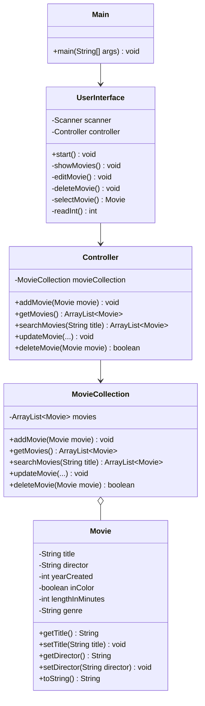

# Klassediagram – Filmsamling

```mermaid
classDiagram
    class Main {
        +main(String[] args) void
    }

    class UserInterface {
        -Scanner scanner
        -Controller controller
        +start() void
        -showMovies() void
        -editMovie() void
        -deleteMovie() void
        -selectMovie() Movie
        -readInt() int
    }

    class Controller {
        -MovieCollection movieCollection
        +addMovie(Movie movie) void
        +getMovies() ArrayList~Movie~
        +searchMovies(String title) ArrayList~Movie~
        +updateMovie(...) void
        +deleteMovie(Movie movie) boolean
    }

    class MovieCollection {
        -ArrayList~Movie~ movies
        +addMovie(Movie movie) void
        +getMovies() ArrayList~Movie~
        +searchMovies(String title) ArrayList~Movie~
        +updateMovie(...) void
        +deleteMovie(Movie movie) boolean
    }

    class Movie {
        -String title
        -String director
        -int yearCreated
        -boolean inColor
        -int lengthInMinutes
        -String genre
        +getTitle() String
        +setTitle(String title) void
        +getDirector() String
        +setDirector(String director) void
        +toString() String
    }

    Main --> UserInterface
    UserInterface --> Controller
    Controller --> MovieCollection
    MovieCollection o-- Movie
```
